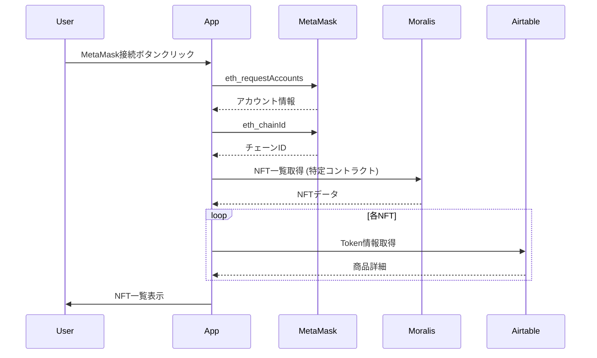
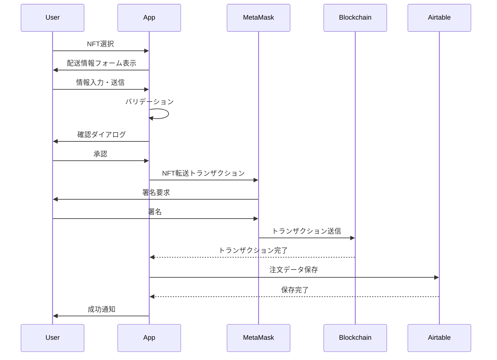

# MLTG Web Application - 技術仕様書

**バージョン**: 1.1.0
**最終更新日**: 2025年10月30日
**プロジェクト**: MetagriLabo Thanks Gift (MLTG) NFT交換プラットフォーム

---

## 目次

1. [システム概要](#システム概要)
2. [アーキテクチャ](#アーキテクチャ)
3. [技術スタック](#技術スタック)
4. [機能仕様](#機能仕様)
5. [データフロー](#データフロー)
6. [セキュリティ](#セキュリティ)
7. [API仕様](#api仕様)
8. [フォームバリデーション](#フォームバリデーション)
9. [エラーハンドリング](#エラーハンドリング)
10. [状態管理](#状態管理)
11. [開発ガイドライン](#開発ガイドライン)
12. [デプロイメント](#デプロイメント)

---

## システム概要

### プロジェクト目的

MetagriLabo Thanks Gift (MLTG) は、NFTを実物商品と交換できるWeb3プラットフォームです。ユーザーは保有するNFTを選択し、配送情報を入力することで、対応する物理的な商品（農産物、オリジナルTシャツなど）と交換できます。

### 主要機能

1. **ウォレット接続**
   - MetaMask統合
   - WalletConnect対応
   - マルチチェーン対応（Polygon, Ethereum, Base等）

2. **NFT管理**
   - 保有NFT一覧表示
   - NFTメタデータの取得・表示
   - IPFS画像のレンダリング

3. **商品交換システム**
   - フォームベースの配送情報入力
   - Tシャツサイズ選択（特定NFT用）
   - NFT転送とデータベース記録

4. **ユーザー体験**
   - リアルタイムバリデーション
   - エラー通知システム
   - ローディングインジケーター
   - Polygon自動切り替え機能

---

## アーキテクチャ

### システムアーキテクチャ図

```
┌─────────────────┐
│   ユーザー      │
└────────┬────────┘
         │
         ▼
┌─────────────────────────────────┐
│   フロントエンド (React SPA)     │
│  ┌──────────────────────────┐  │
│  │  - MetaMask Integration  │  │
│  │  - ThirdWeb SDK          │  │
│  │  - Bootstrap UI          │  │
│  └──────────────────────────┘  │
└──────┬──────────────────┬───────┘
       │                  │
       ▼                  ▼
┌─────────────┐    ┌──────────────┐
│  Moralis    │    │  Airtable    │
│  API        │    │  Database    │
│  (NFT Data) │    │  (Orders)    │
└─────────────┘    └──────────────┘
       │
       ▼
┌─────────────────────────┐
│  Blockchain Network     │
│  - Polygon Mainnet      │
│  - Ethereum Mainnet     │
│  - Base                 │
└─────────────────────────┘
```

### コンポーネント構成

```
src/
├── App.js              # メインアプリケーションコンポーネント
│   ├── State Management
│   ├── Web3 Integration
│   ├── NFT Display
│   ├── Form Handling
│   └── Error Handling
├── App.css             # スタイル定義
├── index.js            # エントリーポイント
└── images/             # 静的画像資産
```

---

## 技術スタック

### フロントエンド

| カテゴリ | 技術 | バージョン | 用途 |
|---------|------|-----------|------|
| **フレームワーク** | React | 18.2.0 | UI構築 |
| **UIライブラリ** | React Bootstrap | 2.5.0 | コンポーネント |
| **ルーティング** | React Router DOM | 6.4.2 | SPA ルーティング |
| **Web3** | ThirdWeb SDK | 3.10.67 | スマートコントラクト操作 |
| **Web3** | ethers.js | 5.7.2 | Ethereum相互作用 |
| **ウォレット** | WalletConnect | 1.8.0 | モバイルウォレット接続 |
| **ビルドツール** | Create React App | 5.0.1 | 開発環境 |
| **ビルド拡張** | CRACO | 7.1.0 | Webpack設定 |

### 外部サービス

| サービス | 用途 | 認証方式 |
|---------|------|---------|
| **Moralis API** | NFTメタデータ取得 | API Key |
| **Airtable API** | 注文データ保存 | Personal Access Token |
| **IPFS** | NFT画像ホスティング | パブリック |
| **Firebase Hosting** | Webホスティング | なし |
| **Google Analytics** | アクセス解析 | トラッキングID |

### ブロックチェーン対応

| ネットワーク | Chain ID | 用途 |
|-------------|----------|------|
| Polygon Mainnet | 137 (0x89) | メイン運用 |
| Ethereum Mainnet | 1 (0x1) | サポート |
| Goerli Testnet | 5 (0x5) | テスト |
| Mumbai Testnet | 80001 (0x13881) | テスト |
| Base Mainnet | 8453 (0x2105) | サポート |
| Base Sepolia | 84532 (0x14980) | テスト |

---

## 機能仕様

### 1. ウォレット接続機能

#### MetaMask接続

**関数**: `getAccount()`

```javascript
// 機能: MetaMaskからアカウント情報を取得
// 戻り値: string（アドレス）または空文字列
// エラーハンドリング:
//   - 4001: ユーザーが接続を拒否
//   - その他: コンソールにエラー出力
```

**イベントリスナー**:
- `accountsChanged`: アカウント変更時
- `chainChanged`: ネットワーク変更時

#### Polygon自動切り替え

**関数**: `switchToPolygon()`

```javascript
// 機能: Polygon Mainnetへ自動切り替え
// プロセス:
//   1. wallet_switchEthereumChain を呼び出し
//   2. エラーコード 4902 の場合、wallet_addEthereumChain で追加
//   3. RPC URL、チェーン名、通貨情報を自動設定
```

**設定値**:
- Chain ID: `0x89`
- RPC URL: `https://polygon-rpc.com/`
- Currency: MATIC
- Block Explorer: `https://polygonscan.com/`

---

### 2. NFT表示機能

#### NFTデータ取得

**関数**: `handleAccountChanged()`

**フロー**:
```
1. アカウント情報取得
2. チェーンID取得
3. チェーン名変換
4. Moralis APIでNFT取得（特定コントラクトのみ）
5. 並列処理でAirtable情報取得
6. NFTリストをソート（発行日順）
7. State更新
```

**対象コントラクト**:
```
環境変数 NFT_CONTRACT_ADDRESS で設定
```

**データ構造**:
```javascript
{
  contract_name: string,      // コントラクト名
  image: string,              // IPFS画像URL
  nft_name: string,           // NFT名
  present_detail: string,     // 交換可能商品
  token_address: string,      // コントラクトアドレス
  token_id: string,           // トークンID
  amount: number,             // 所有数量
  key_id: string              // Airtable Key ID
}
```

---

### 3. フォームバリデーション

#### バリデーションルール

**関数**: `validateForm(formData)`

| フィールド | ルール | エラーメッセージ |
|-----------|--------|----------------|
| **名前** | 2文字以上 | "名前は2文字以上で入力してください" |
| **郵便番号** | `^\d{3}-\d{4}$` | "郵便番号は「123-4567」の形式で入力してください" |
| **メールアドレス** | `^[^\s@]+@[^\s@]+\.[^\s@]+$` | "有効なメールアドレスを入力してください" |
| **電話番号** | `^0\d{1,4}-\d{1,4}-\d{4}$` | "電話番号は「000-0000-0000」の形式で入力してください" |

#### バリデーション実装

```javascript
// 入力値検証
const errors = validateForm(formData);

// エラーがある場合
if (Object.keys(errors).length > 0) {
  setFormErrors(errors);
  setError("入力内容にエラーがあります。修正してください。");
  return; // 送信を中断
}
```

---

### 4. 商品交換フロー

#### 標準フロー

```
1. ユーザーがNFTを選択
2. 配送情報フォームを表示
3. ユーザーが情報を入力
4. バリデーション実行
5. 確認ダイアログ表示
6. ユーザーが承認
7. NFT転送トランザクション
8. Airtableにデータ保存
9. 成功通知表示
10. フォームリセット
```

#### Tシャツ交換フロー（特定NFT）

**対象Key ID**:
```javascript
// Tシャツ交換対象のAirtable Record IDリスト
// 詳細は管理者に確認してください
```

**追加フィールド**:
- サイズ選択: S, M, L, XL, その他
- その他サイズ: 自由入力テキスト

---

### 5. エラーハンドリング

#### エラー通知コンポーネント

**コンポーネント**: `ErrorNotification`

```javascript
// Props:
// - error: string | null
// - onClose: function

// 機能:
// - エラーメッセージを Alert コンポーネントで表示
// - 閉じるボタンで非表示化
```

#### トランザクションエラー

| エラーコード | 原因 | ユーザーメッセージ |
|-------------|------|-------------------|
| **4001** | ユーザーキャンセル | "トランザクションがキャンセルされました" |
| **-32603** | 内部エラー | "NFTの転送に失敗しました。ガス代が不足している可能性があります" |
| **insufficient funds** | ガス代不足 | "ガス代が不足しています。ウォレットに十分なMATICがあることを確認してください" |
| **その他** | 不明なエラー | "予期しないエラーが発生しました: [エラーメッセージ]" |

#### APIエラー

```javascript
// Moralis API エラー
if (!resNftData.ok) {
  throw new Error(`Moralis API Error: ${resNftData.status}`);
}

// Airtable API エラー
if (!resTokenInfo.ok) {
  console.warn(`Airtable API Error for token ${nft.token_id}: ${resTokenInfo.status}`);
  return null;
}
```

---

## データフロー

### NFT取得フロー



### 交換処理フロー



---

## セキュリティ

### 環境変数管理

**重要**: すべてのAPI KeyとシークレットはGitにコミットしないこと

#### 必須環境変数

```bash
# .env
GENERATE_SOURCEMAP=false
REACT_APP_MORALIS_API_KEY=your_moralis_api_key_here
REACT_APP_THIRDWEB_CLIENT_ID=your_thirdweb_client_id_here
REACT_APP_AIRTABLE_API_KEY=your_airtable_api_key_here
```

#### セキュリティベストプラクティス

1. **API Keyの保護**
   - `.env` ファイルを `.gitignore` に追加
   - ハードコードされたキーをすべて削除
   - 本番環境ではFirebase Environment Variablesを使用

2. **クライアントサイドセキュリティ**
   - XSS対策: Reactのデフォルトエスケープを使用
   - 入力値サニタイゼーション
   - HTTPS必須（Firebase Hostingで自動）

3. **ウォレットセキュリティ**
   - ユーザーの秘密鍵は保存しない
   - トランザクション内容を明確に表示
   - 署名要求前に確認ダイアログ

4. **推奨される追加対策**
   - Content Security Policy (CSP) ヘッダー
   - サーバーサイドバリデーション（Firebase Functions）
   - Rate Limiting

---

## API仕様

### Moralis API

**エンドポイント**: `https://deep-index.moralis.io/api/v2.2/`

#### NFT取得

```
GET /{address}/nft

Query Parameters:
- chain: string (例: "polygon")
- token_addresses: string (コントラクトアドレス)
- limit: number (最大100)

Headers:
- X-API-Key: {REACT_APP_MORALIS_API_KEY}
- accept: application/json

Response:
{
  "result": [
    {
      "token_address": "0x...",
      "token_id": "1",
      "amount": "1",
      "name": "NFT Name",
      "metadata": "{...}"
    }
  ]
}
```

### Airtable API

**Base ID**: 環境変数 `AIRTABLE_BASE_ID` で設定

#### Token情報取得

```
GET /api/airtable-nft-info

Query Parameters:
- tokenAddress: NFTのコントラクトアドレス
- tokenId: トークンID

Response:
{
  "records": [
    {
      "id": "rec...",
      "fields": {
        "Key_ID": "rec...",
        "Thanks_Gift": "商品名",
        "Contract_ID": "0x...",
        "Token_ID": 1
      }
    }
  ]
}
```

#### 注文データ保存

```
POST /api/airtable-orders

Headers:
- Content-Type: application/json

Body:
{
  "records": [
    {
      "fields": {
        "Key_ID": "rec...",
        "Thanks_Gift": "商品名",
        "Name": "山田太郎",
        "Zip_Code": "123-4567",
        "Address": "東京都...",
        "Tel": "090-1234-5678",
        "Mail": "test@example.com",
        "Notes": "備考",
        "Size": "M",
        "Size_Other": ""
      }
    }
  ]
}
```

> **注意**: APIキーはサーバーサイドで管理されているため、クライアントから直接Airtable APIを呼び出すことはできません。必ず `/api/*` エンドポイントを使用してください。

---

## 状態管理

### グローバルState

```javascript
// ウォレット関連
const [account, setAccount] = useState("");           // 接続アカウント
const [chainId, setChainId] = useState(0);           // チェーンID
const [chainName, setChainName] = useState("");      // チェーン名

// NFT関連
const [nfts, setNfts] = useState([]);                // NFT一覧
const [selectedNft, setSelectedNft] = useState({});  // 選択NFT

// フォーム関連
const [size, setSize] = useState("");                // サイズ選択
const [otherSize, setOtherSize] = useState("");      // その他サイズ

// UI状態
const [loading, setLoading] = useState(false);       // ローディング
const [error, setError] = useState(null);            // エラーメッセージ
const [formErrors, setFormErrors] = useState({});    // フォームエラー
const [isSubmitting, setIsSubmitting] = useState(false); // 送信中
```

---

## 開発ガイドライン

### コーディング規約

#### JavaScript/React

1. **命名規則**
   - コンポーネント: PascalCase (`ErrorNotification`)
   - 関数: camelCase (`handleSubmit`)
   - 定数: UPPER_SNAKE_CASE (`API_ENDPOINT`)
   - State: camelCase (`formErrors`)

2. **関数定義**
   - コンポーネント外の関数: `const functionName = () => {}`
   - コンポーネント: `function ComponentName() {}`

3. **コメント**
   - 複雑なロジックには日本語コメント
   - 関数の説明には JSDoc形式を推奨

#### スタイル

1. **CSS**
   - Bootstrap優先使用
   - カスタムスタイルは `App.css` に集約
   - クラス名: kebab-case

2. **レスポンシブ**
   - モバイルファースト
   - メディアクエリ: 480px, 768px, 1024px

### Git ワークフロー

1. **ブランチ戦略**
   ```
   main (本番)
   └── develop (開発)
       └── feature/feature-name (機能開発)
       └── bugfix/bug-description (バグ修正)
   ```

2. **コミットメッセージ**
   ```
   種類: 簡潔な説明

   詳細な説明（オプション）

   関連Issue: #123
   ```

   **種類**:
   - `機能追加`: 新機能
   - `修正`: バグ修正
   - `改善`: 既存機能の改善
   - `リファクタリング`: コード整理
   - `ドキュメント`: ドキュメント更新
   - `セキュリティ`: セキュリティ関連

### テスト

#### 手動テスト項目

1. **ウォレット接続**
   - [ ] MetaMask接続成功
   - [ ] アカウント切り替え検知
   - [ ] ネットワーク切り替え検知

2. **NFT表示**
   - [ ] NFT一覧正常表示
   - [ ] 画像読み込み成功
   - [ ] データソート確認

3. **フォーム**
   - [ ] バリデーション動作
   - [ ] エラーメッセージ表示
   - [ ] 送信成功

4. **エラー処理**
   - [ ] トランザクションキャンセル
   - [ ] ガス代不足エラー
   - [ ] ネットワークエラー

---

## デプロイメント

### Firebase Hosting

#### 初回セットアップ

```bash
# Firebase CLIインストール
npm install -g firebase-tools

# Firebaseログイン
firebase login

# プロジェクト初期化（既存の場合はスキップ）
firebase init hosting
```

#### デプロイ手順

```bash
# 1. 環境変数確認
# .env ファイルが正しく設定されているか確認

# 2. ビルド
npm run build

# 3. デプロイ
firebase deploy --only hosting

# 4. 確認
# デプロイ完了後、提供されたURLで動作確認
```

#### 環境変数設定（本番）

Firebase Hostingでは環境変数が直接サポートされていないため、以下のいずれかの方法を使用：

**方法1: ビルド時に注入**
```bash
# .env.production を作成
REACT_APP_MORALIS_API_KEY=production_key
REACT_APP_AIRTABLE_API_KEY=production_key

# ビルド
npm run build
```

**方法2: Firebase Functions経由**（推奨）
```javascript
// functions/index.js
const functions = require('firebase-functions');
exports.config = functions.https.onRequest((req, res) => {
  res.json({
    moralisApiKey: functions.config().moralis.key,
    airtableApiKey: functions.config().airtable.key
  });
});
```

### デプロイチェックリスト

- [ ] `.env` ファイルが `.gitignore` に含まれている
- [ ] 本番用API Keyを設定
- [ ] ビルドエラーがない
- [ ] テストが全て通過
- [ ] セキュリティヘッダー設定確認
- [ ] Google Analytics設定確認

---

## トラブルシューティング

### よくある問題

#### 1. NFTが表示されない

**原因**:
- Polygonネットワークに接続されていない
- API Keyが無効
- コントラクトアドレスが間違っている

**解決方法**:
```javascript
// デバッグ用ログ追加
console.log('Chain:', chainName);
console.log('Account:', account);
console.log('NFTs:', nfts);
```

#### 2. 環境変数が読み込まれない

**原因**:
- 開発サーバーが再起動されていない
- 環境変数名が `REACT_APP_` で始まっていない

**解決方法**:
```bash
# 開発サーバー再起動
npm start
```

#### 3. トランザクションが失敗する

**原因**:
- ガス代不足
- ネットワーク混雑
- コントラクトエラー

**解決方法**:
- ウォレットにMATICを追加
- ガス代を上げて再試行
- エラーメッセージを確認

---

## 付録

### 参考リンク

- [React公式ドキュメント](https://react.dev/)
- [ThirdWeb公式ドキュメント](https://portal.thirdweb.com/)
- [Moralis API リファレンス](https://docs.moralis.io/)
- [Airtable API リファレンス](https://airtable.com/developers/web/api/introduction)
- [Firebase Hosting ガイド](https://firebase.google.com/docs/hosting)

### 用語集

| 用語 | 説明 |
|------|------|
| **NFT** | Non-Fungible Token（非代替性トークン） |
| **MLTG** | MetagriLabo Thanks Gift |
| **Web3** | 分散型インターネット |
| **ガス代** | トランザクション手数料 |
| **MATIC** | Polygonネットワークのネイティブトークン |
| **IPFS** | InterPlanetary File System（分散型ファイルシステム） |
| **SPA** | Single Page Application |

---

## 変更履歴

| バージョン | 日付 | 変更内容 | 担当者 |
|-----------|------|---------|--------|
| 1.1.0 | 2025-10-30 | フォームバリデーション、エラーハンドリング、UX改善追加 | Claude Code |
| 1.0.0 | 2025-01-03 | 初版作成 | - |

---

**作成者**: Claude Code
**レビュー**: -
**承認**: -
